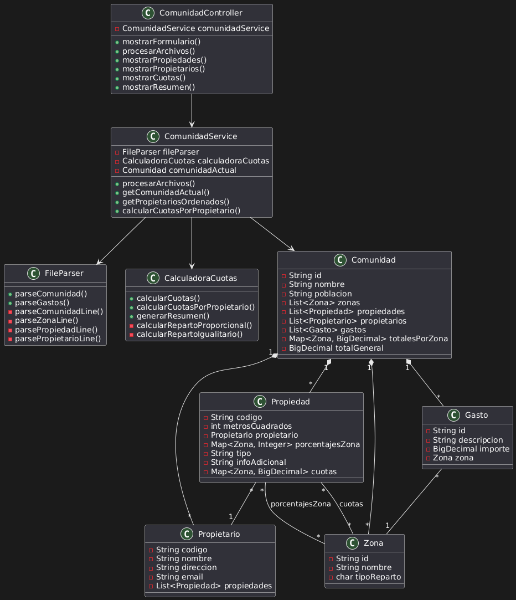

# Arquitectura General de la Aplicación

- [Clases SVG](./Diagrama-clases.svg)

## 1. Arquitectura en Capas

### 1.1 Capa de Presentación (UI Layer)
- **Componentes**:
  - `ComunidadController`: Controlador principal que maneja las peticiones HTTP
  - Plantillas Thymeleaf: Vistas de la aplicación
  - Recursos estáticos (CSS, JavaScript)

- **Responsabilidades**:
  - Interfaz de usuario
  - Formularios de entrada
  - Visualización de datos
  - Navegación entre páginas

### 1.2 Capa de Servicio (Service Layer)
- **Componentes**:
  - `ComunidadService`: Servicio principal que orquesta la lógica de negocio
  - `CalculadoraCuotas`: Servicio de cálculo de cuotas
  - `FileParser`: Servicio de procesamiento de archivos

- **Responsabilidades**:
  - Lógica de negocio
  - Procesamiento de datos
  - Validaciones
  - Coordinación entre componentes

### 1.3 Capa de Modelo (Model Layer)
- **Componentes**:
  - Entidades de dominio (`Comunidad`, `Propiedad`, `Propietario`, `Zona`, `Gasto`)
  - DTOs (Data Transfer Objects)
  - Validadores

- **Responsabilidades**:
  - Representación de datos
  - Validación de datos
  - Reglas de negocio básicas

## 2. Módulos Principales

### 2.1 Módulo de Gestión de Archivos
- **Componentes**:
  - `FileParser`
  - Procesadores de archivos específicos

- **Funcionalidades**:
  - Lectura de archivos de comunidad
  - Lectura de archivos de gastos
  - Validación de formatos
  - Transformación de datos

### 2.2 Módulo de Cálculo de Cuotas
- **Componentes**:
  - `CalculadoraCuotas`
  - Estrategias de reparto

- **Funcionalidades**:
  - Cálculo de cuotas proporcionales
  - Cálculo de cuotas igualitarias
  - Generación de resúmenes
  - Cálculo de totales

### 2.3 Módulo de Gestión de Comunidad
- **Componentes**:
  - `ComunidadService`
  - Entidades de dominio

- **Funcionalidades**:
  - Gestión de propiedades
  - Gestión de propietarios
  - Gestión de zonas
  - Gestión de gastos

### 2.4 Módulo de Presentación
- **Componentes**:
  - `ComunidadController`
  - Plantillas Thymeleaf
  - Recursos estáticos

- **Funcionalidades**:
  - Formularios de carga
  - Visualización de datos
  - Navegación
  - Interfaz de usuario

## 3. Flujo de Datos

### 3.1 Proceso de Carga de Archivos
1. Usuario sube archivos
2. `ComunidadController` recibe la petición
3. `ComunidadService` coordina el proceso
4. `FileParser` procesa los archivos
5. Se crean las entidades de dominio
6. Se calculan las cuotas
7. Se muestra el resumen

### 3.2 Proceso de Cálculo de Cuotas
1. `ComunidadService` solicita el cálculo
2. `CalculadoraCuotas` procesa los datos
3. Se aplican las estrategias de reparto
4. Se generan los totales
5. Se actualiza el modelo
6. Se muestra la información

## 4. Patrones de Diseño Utilizados

### 4.1 Patrones Estructurales
- **MVC (Model-View-Controller)**
  - Separación de responsabilidades
  - Mejor mantenibilidad
  - Código más organizado

### 4.2 Patrones de Comportamiento
- **Strategy**
  - Diferentes estrategias de cálculo
  - Fácil extensión
  - Código flexible

### 4.3 Patrones Creacionales
- **Factory**
  - Creación de objetos de dominio
  - Encapsulación de la lógica de creación

## 5. Características Técnicas

### 5.1 Inyección de Dependencias
- Uso de `@Autowired` para la inyección
- Componentes desacoplados
- Fácil testing

### 5.2 Validación de Datos
- Validación de entrada
- Manejo de errores
- Mensajes de error claros

### 5.3 Procesamiento de Archivos
- Lectura eficiente
- Validación de formatos
- Manejo de errores

### 5.4 Cálculos
- Precisión decimal
- Estrategias de redondeo
- Validación de resultados